# Yhteen tauluun kohdistuvien kyselyiden harjoitukset
# tehtävä 1
SELECT *
FROM goal;
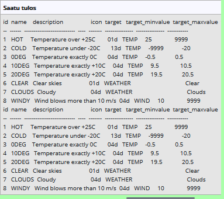

# tehtävä 2
SELECT name as airport_type
FROM airport
WHERE iso_country ="FI";
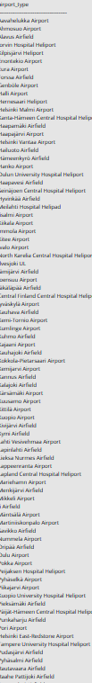

# tehtävä 3
SELECT name
FROM airport
WHERE iso_country ="FI"
ORDER BY name;
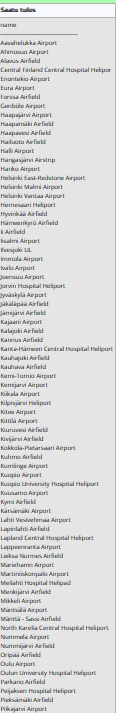

# tehtävä 4
select name,type
from airport
where iso_country = "FI"
order by  type, name;
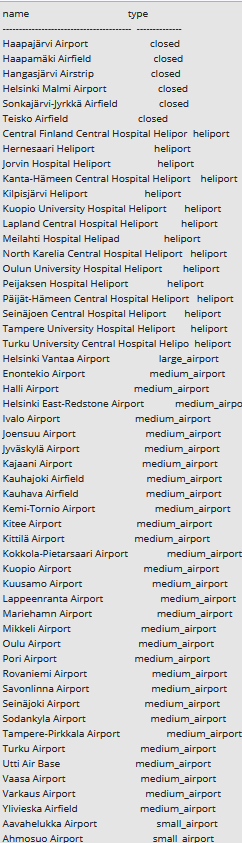

# tehtävä 5
select name
from country
where name like "F%";
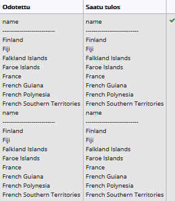

# tehtävä 6
select name
from country
where name like "%F%";
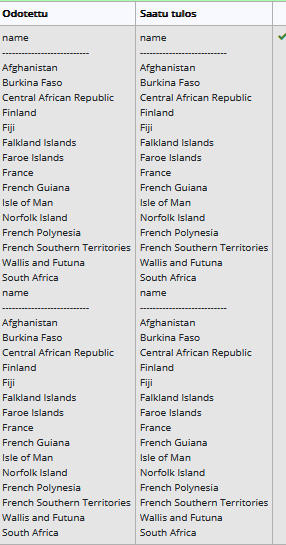

# tehtävä 7
select location
from game
where location = "EGCC";
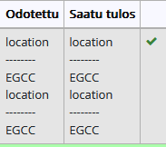

# tehtävä 8
select co2_consumed
from game 
where screen_name = "Ilkka";
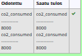

# tehtävä 9
select distinct co2_budget
from game;
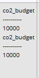

# Where-osan liitosehto harjoitukset:

# tehtävä1
select country.name as "country name", airport.name as "airport name"
from country, airport
where country.name = "Iceland" and airport.iso_country = country.iso_country;
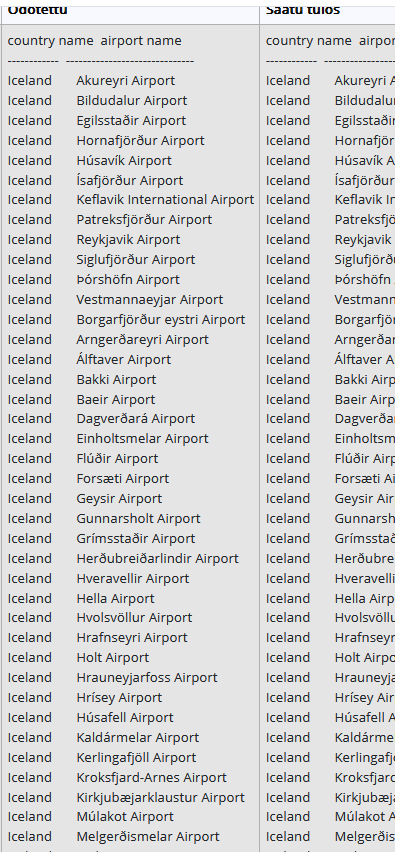

# tehtävä2
select airport.name as "airport name"
from country, airport
where airport.iso_country = country.iso_country and country.name = "France" and airport.type = "large_airport";
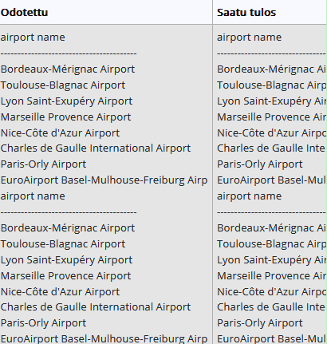

# tehtävä3
select country.name as "country_name", airport.name as "airport_name"
from country, airport
where airport.iso_country = country.iso_country and country.continent = "AN";
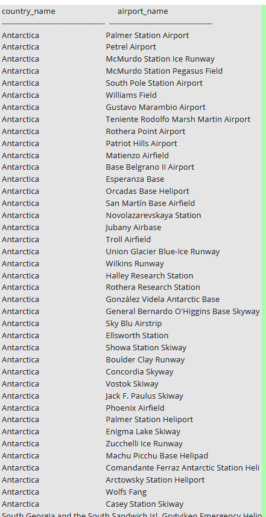

# tehtävä4
select elevation_ft 
from airport, game
where location = ident and screen_name = "Heini";
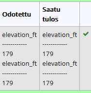

# tehtävä5
select elevation_ft * 0.3048 as elevation_m
from airport, game
where location = ident and screen_name = "Heini";
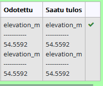

# tehtävä6
select airport.name
from airport, game
where location = ident and screen_name = "Ilkka";
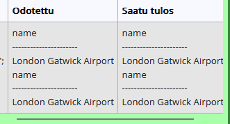

# tehtävä7
select country.name
from airport, country, game
where country.iso_country = airport.iso_country 
and location = ident and screen_name = "Ilkka";
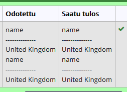

# tehtävä8
select goal.name
from goal, game, goal_reached
where game.id = game_id and goal.id = goal_id 
and screen_name = "Heini";
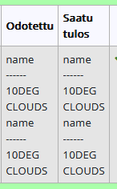

# tehtävä9
select airport.name 
from airport, game, goal, goal_reached
where ident = location 
and game.id = game_id and goal.id = goal_id and 
screen_name = "Ilkka" and goal.name = "CLOUDS";
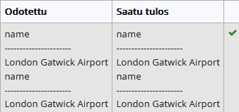

# tehtävä10
select country.name 
from country, airport, game, goal, goal_reached
where airport.iso_country = country.iso_country and ident = location 
and game.id = game_id and goal.id = goal_id and 
screen_name = "Ilkka" and goal.name = "CLOUDS";

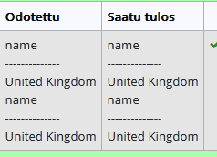

